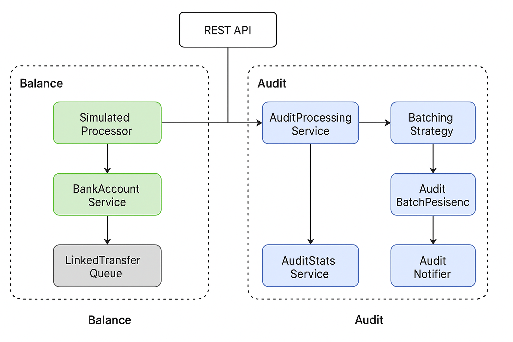

# Balance Streaming System
**High-Throughput, Low-Latency Transaction Engine**
A performance-aware Java system that simulates streaming credit/debit ingestion, balance computation, and audit batching — designed with modular domain boundaries, observability, and microservice evolution in mind.

### Architectural Layers



## Project Objective

Design an application that:

- Ingests and processes real-time credit/debit transactions at 50 TPS (25 credits + 25 debits).  
- Tracks a single account’s balance in real time, exposed via REST.  
- Every 1,000 transactions, forms batches whose absolute sum ≤ £1,000,000.  
- Role-protected API surface (`USER`, `OPS`)
- Minimizes the number of batches per submission to reduce costs.  
- Exposes rich metrics and supports performance validation.

The system emphasizes clean domain boundaries, operational observability, and architectural evolution toward event-driven microservices.

---

## Features

- Real-time credit/debit transaction ingestion simulation (~50 TPS)
- Atomic balance updates with observability hooks
- Role-based security: OPS and USER scoped access
- Configurable batching algorithm for cost-efficient submissions
- REST APIs for balance, audit stats, and simulation control
- In-memory persistence layer (swappable)
- CI pipeline via GitHub Actions
- Observability-first: REST APIs for transaction, balance, audit stats, and telemetry
- Architected for scalability, clarity, and production-grade CI/CD readiness.

---

## 📦 Package Structure

| Boundary     | Package Prefix                             | Responsibility                                  |
|--------------|---------------------------------------------|--------------------------------------------------|
| `account`    | `com.arctiq.liquidity.balsys.account`       | Balance tracking and transaction application     |
| `audit`      | `com.arctiq.liquidity.balsys.audit`         | Audit batching, submission, metrics, and persistence |
| `producer`   | `com.arctiq.liquidity.balsys.producer`      | Simulates credit/debit transaction flow (~50 TPS) |
| `shared`     | `com.arctiq.liquidity.balsys.shared`        | DTOs, factories, domain types, and observability tools |
| `telemetry`  | `com.arctiq.liquidity.balsys.telemetry`     | Audit stats tracking and runtime event logging     |
| `exception`  | `com.arctiq.liquidity.balsys.exception`     | Domain-safe exception handling with global mappers |
| `transaction`| `com.arctiq.liquidity.balsys.transaction`   | Immutable domain model (`Transaction` record, validation) |

---

## 🧭 Architecture Overview

> For full design details and cloud integration strategy, see [docs/system-notes.md](./docs/system-notes.md)

```
SimulatedProducer
        ↓
BankAccountService → LinkedTransferQueue
        ↓
AuditProcessingService → BatchingAlgorithm (bin-pack)
        ↓
AuditBatchPersistence + AuditNotifier
        ↓
AuditStatsService → REST API
```
---

## Audit Batching Behavior

Audit submissions occur automatically after **exactly 1000 processed transactions**, matching the technical exercise requirement.
Batches are assembled using a pluggable `BatchingStrategy`, with two available options:
- `GreedyBatchingStrategy`: inserts transactions sequentially into the first acceptable batch
- `FirstFitDecreasingBatchingStrategy`: sorts transactions by absolute value descending and minimizes batch count using near-optimal bin packing

Each batch:
- Contains only transactions that sum to **≤ £1,000,000** (credits and debits treated as positive)
- Is computed using the domain-accurate `Money` abstraction

Upon submission, batch details are printed to the console by the `ConsoleAuditNotifier`, in a format compliant with the spec:

---

## 🔐 Access Control

| Role     | Username | Password  | Permissions                        |
|----------|----------|-----------|------------------------------------|
| `USER`   | `user`   | `password`| Account balance access             |
| `OPS`    | `ops`    | `password`| Simulation + Audit control         |

Postman: Use Basic Auth → Authorization tab → Type: Basic Auth

---

## REST Endpoints

| Endpoint              | Summary                                 | Role    |
|-----------------------|------------------------------------------|---------|
| `/account/balance`    | Returns computed account balance         | USER/OPS|
| `/simulation/start`   | Starts transaction emitters              | OPS     |
| `/simulation/stop`    | Stops active simulation                  | OPS     |
| `/audit/summary`      | View audit stats and telemetry snapshot  | OPS     |
| `/audit/batches`      | Retrieve audit batch history             | OPS     |
| `/audit/stats`        | Aggregated audit totals                  | OPS     |
| `/audit/telemetry`    | Lifecycle metrics and queue signals      | OPS     |

Swagger UI: `http://localhost:8080/swagger-ui/index.html`

---

## ☁️ Cloud-Ready Design

| Concern             | AWS Service Suggestion            |
|---------------------|-----------------------------------|
| Queue ingestion     | Kafka or Kinesis            |
| Persistence         | Aurora or DynamoDB               |
| Batch durability    | Amazon S3 or PostgreSQL          |
| External audit flow | EventBridge or SNS               |
| Observability       | CloudWatch    |

---

## 🧠 Architectural Highlights

- Clean separation of domains → microservice-ready
- Domain-aligned packages for account, audit, producer, transaction, telemetry, shared
- Lock-free concurrency and backpressure via bounded queue
- Pluggable strategy interface: switch batching algorithms at runtime
- Observability-first with structured metrics
- Prepared for microservice evolution and containerization
- Ready for async event ingestion via Kafka or streaming gateway

---

## CI/CD Integration

Automated Maven-based workflow via GitHub Actions:
- Validates builds and runs tests on every push
- Extensible to support deployment to cloud environments
- CI/CD configuration is located in `.github/workflows` directory
- Future-ready for Docker, ECS, and staging promotion

---

## Validation Tips

- Simulate traffic with http://localhost:8080/simulation/start?count=1000&durationSeconds=10
- Watch http://localhost:8080/audit/summary for average TPS and batch composition

---

## How to Run Locally

```bash
./mvnw spring-boot:run
```
## Run with Docker

1. Build Container Image
```
docker build -t balsys .
```
2. Run Container
```
docker run -p 8080:8080 balsys
```
---

## 📄 License

MIT
```
---
