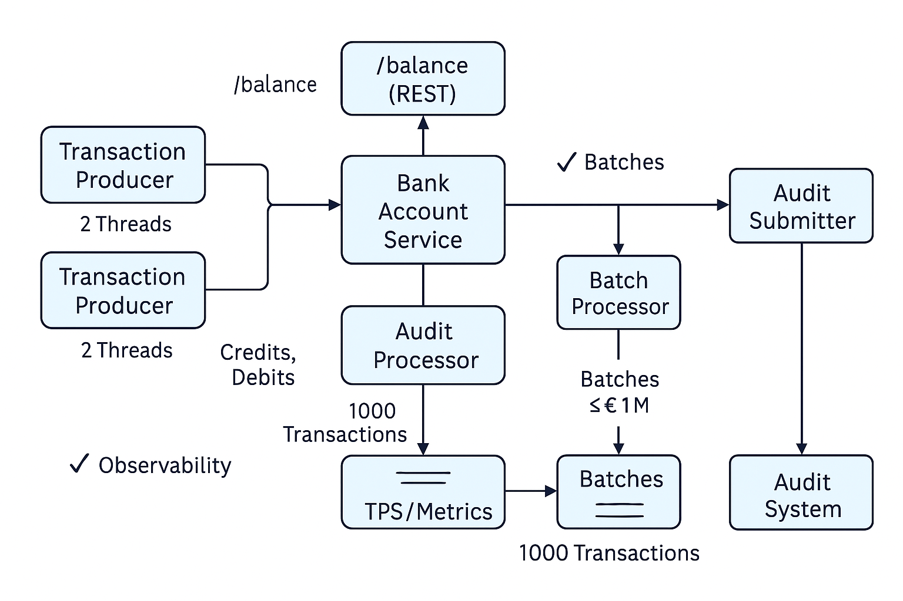

# System Notes – Internal Architecture & Design Trade-Offs

This document details the internal mechanics, design rationale, concurrency model, durability concerns, and evolution strategy for the Balance Streaming System.

---

## 📷 Architecture Diagram



## Domain Boundaries

| Domain      | Package Prefix                                      | Notes                                                                  |
|-------------|-----------------------------------------------------|------------------------------------------------------------------------|
| `account`   | `com.arctiq.liquidity.balsys.transaction.service`   | Applies transactions and computes running balance                      |
| `audit`     | `com.arctiq.liquidity.balsys.audit`                 | Forms and persists audit batches via pluggable batching strategies     |
| `producer`  | `com.arctiq.liquidity.balsys.transaction.producer`  | Streams credit/debit transactions via orchestrated simulation loops    |
| `shared`    | `com.arctiq.liquidity.balsys.shared`                | Common domain utilities                                                |
| `telemetry` | `com.arctiq.liquidity.balsys.audit.telemetry`       | Runtime metrics, audit stats, transaction outcomes, and latency charts |
| `transaction`| `com.arctiq.liquidity.balsys.transaction`          | Domain model, validation, records                                      |
| `exception` | `com.arctiq.liquidity.balsys.exception`             | Global mappers and safe exception handling                             |

---

## 🔐 Security Architecture

**Spring Security Integration**
- Configured via `SecurityConfig` and `UserConfig`
- Route-level enforcement with role-specific access
- In-memory user store with `BCryptPasswordEncoder`

### Route Protection Summary

```java
http.authorizeHttpRequests(auth -> auth
  .requestMatchers("/swagger-ui/**", "/v3/api-docs/**").permitAll()
  .requestMatchers("/account/**").hasAnyRole("USER", "OPS")
  .requestMatchers("/simulation/**").hasRole("OPS")
  .requestMatchers("/audit/**").hasRole("OPS")
  .anyRequest().authenticated());

## 🎛️ Controller Overview & Swagger

Each controller is annotated with full OpenAPI metadata:

- `SimulationController`: `/simulation/start`, `/simulation/stop`
- `AccountController`: `/account/balance`
- `AuditController`: `/audit/summary`, `/audit/batches`

All use `@Operation`, `@ApiResponses`, and tagged grouping for easy Swagger navigation.

---

## Concurrency Model

- Atomic balance via `AtomicReference<Double>`
- Queue with backpressure via `LinkedTransferQueue` or `LinkedBlockingQueue`
- History captured via `CopyOnWriteArrayList`
- Batch trigger: after N transactions (configurable)
- No thread management inside domain logic (delegated to orchestration service)

---

## Principal Concerns Addressed

| Concern                   | Resolution |
|---------------------------|------------|
| **Consistency**           | Immutable batches via `List.copyOf`, atomic balance updates |
| **Durability**            | Persisted batches via `AuditBatchPersistence`; swappable with Aurora or S3 |
| **Ingestion Guarantees**  | Queue-based delivery with bounded capacity; future Kafka swap |
| **Traceability**          | `AuditStatsService` + REST endpoints + timestamped telemetry |
| **Reviewer Empathy**      | Clean layering, descriptive artifacts, modular naming |

---

## Audit Batching

- Queue: `LinkedTransferQueue<Transaction>` held in `AuditProcessingService` (audit package)  
- Trigger: On each enqueue, if `queue.size() ≥ auditConfig.getBatchSize()` (1 000), start batch formation  
- Algorithm: `GreedyBatchingStrategy` and `FirstFitDecreasingBatchingStrategy` (implements `BatchingStrategy`)
  - Sorts transactions by descending absolute value (`|amount|`)
  - Groups them into the smallest number of batches possible
  - Each batch total constrained to `config.getMaxBatchValue()` (e.g. £1,000,000) 
- Design Intent:
  - Optimized for packing efficiency (first-fit greedy)
  - Favors large transactions first to prevent early overflow
  - Modular—can be swapped via Spring config for alternate strategies
- Submission: `AuditSubmitter` persists each `AuditBatch` via `AuditBatchPersistence` then forwards to external audit via `AuditNotifier`  

---
- Generates structured `AuditBatch` objects with batchId, count, and total
---

## Observability

| Metric Point                | Recorded By                                    |
|-----------------------------|------------------------------------------------|
| Transaction ingestion       | `MetricsCollector.recordTransaction`           |
| Transaction outcomes        | `MetricsCollector.recordTransactionOutcome`    |
| Balance updates             | `MetricsCollector.recordBalance`               |
| Audit submission            | `MetricsCollector.recordAuditSubmission`       |
| Queue size monitoring       | `MetricsCollector.updateQueueSize`             |
| Audit latency timing        | `MetricsCollector.recordAuditLatency`          |
| Throughput (TPS) tracking   | `MetricsCollector.getAverageTPS`               |
| Runtime telemetry events    | `AuditStatsService.recordTelemetryEvent`       |

> Observability endpoints: View live via `http://localhost:8080/audit/summary`

---

## Continuous Integration / Delivery

### Current Setup
- Uses GitHub Actions for Maven build and test verification
- Permissions scoped to allow writing security events and contents
- CI configuration: `.github/workflows/maven.yml`

### Next Steps (suggested)
- Add static analysis tools (e.g. SpotBugs, PMD)
- Containerize application and publish to DockerHub
- Extend workflow to deploy to staging environments (e.g. AWS ECS or Kubernetes)

### Operational Philosophy
- CI/CD pipelines should mirror architectural intent: fast feedback, production parity, and measurable health.
- Design shifts (e.g. microservice decomposition) should trigger corresponding CI/CD evolution.

---

## Cloud Integration Plan

| Concern           | Suggested AWS Service        |
|-------------------|------------------------------|
| Queue ingestion   | Amazon MSK (Kafka) or Kinesis|
| Persistence       | Amazon Aurora (Postgres)     |
| Batch durability  | Amazon S3                    |
| Audit submission  | AWS EventBridge              |
| API Gateway       | API Gateway + JWT + Lambda   |
| Observability     | CloudWatch, OpenTelemetry    |

---

## Producers

- Located in `com.arctiq.liquidity.balsys.producer`
- Emit ~50 transactions/sec (25 credit + 25 debit)
- Timestamped with randomized amounts
- Future: Replace with Kafka producer or external ingestion façade

---

## Migration Strategy

1. Swap internal queue with Kafka topic (low-effort)
2. Split `account` and `audit` into microservices
3. Add Kafka event schemas for `TransactionEvent` and `AuditSubmissionEvent`
4. Replace in-memory stores with Aurora or S3
5. Upgrade security to JWT or OAuth2
6. Introduce OpenTelemetry + Prometheus dashboards
7. Containerize modules with Docker
8. Integrate with AWS (Aurora, EventBridge, ECS)

---

## Status

- ✅ Modular domains in place
- ✅ REST API exposed
- ✅ Metrics + telemetry wired
- ✅ Ready for microservice and cloud evolution
```

---